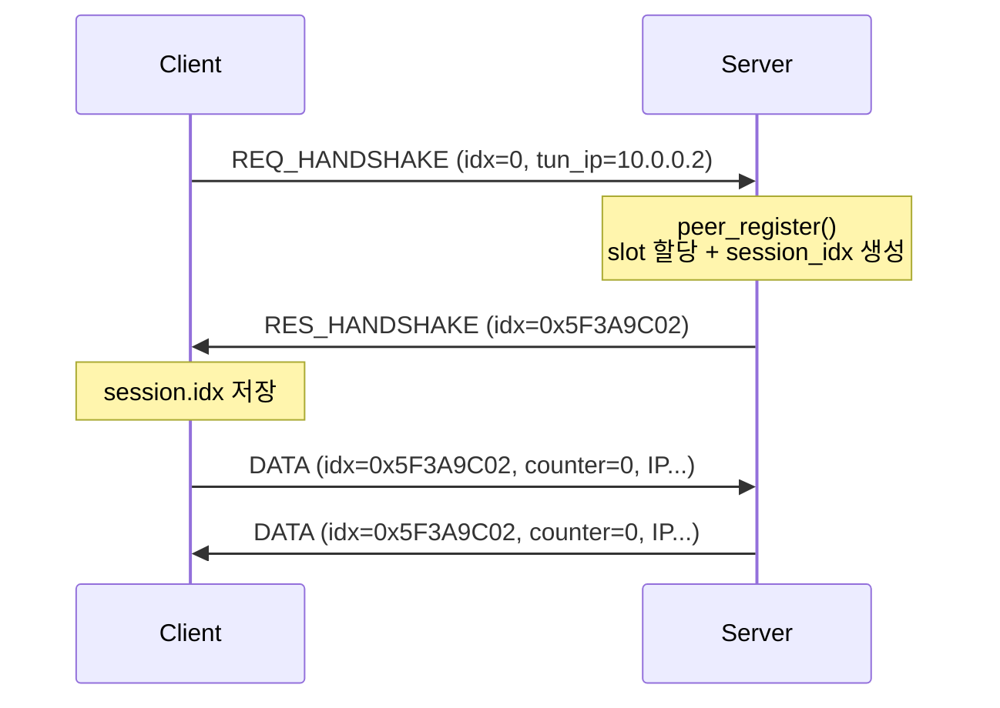

# my_vpn

> C로 처음부터 만드는 L3 VPN — TUN 인터페이스 + UDP 터널 + 세션 기반 피어 관리 + ACL

리눅스 TUN 디바이스로 IP 패킷을 가로채고, 직접 설계한 헤더를 붙여 UDP로 터널링하는 VPN입니다.
외부 VPN 라이브러리 없이 **패킷 포맷, 핸드셰이크, 세션 관리, 접근 제어**를 단계별로 구현하며
Zero Trust Network Access(ZTNA)의 기반 구조를 학습하는 것을 목표로 합니다.

```
 ┌──────────── Client ────────────┐                 ┌──────────── Server ────────────┐
 │  app ──▶ kernel ──▶ tun0       │                 │       tun ──▶ kernel ──▶ app   │
 │                      │         │   UDP :9000     │        ▲                        │
 │              [hdr 16B | IP] ───┼────────────────▶│ verify ┼─ peer table ─ ACL     │
 │                                │◀────────────────┼── [hdr 16B | IP]               │
 └────────────────────────────────┘                 └────────────────────────────────┘
```

---

## Features

- **TUN 기반 L3 터널링** — `IFF_TUN | IFF_NO_PI`로 순수 IPv4 패킷만 송수신
- **자체 와이어 프로토콜** — 버전/타입/세션 idx를 담은 고정 길이 헤더, 빅엔디언 직렬화
- **핸드셰이크 & 세션 idx** — 서버가 클라이언트별로 추측하기 어려운 32bit 세션 식별자 발급
- **피어 테이블** — O(1) 세션 조회, 테이블이 가득 차면 LRU 방식으로 교체
- **ACL** — `src / dst / proto / dport` 기반 first-match 정책, 기본 거부(default deny)
- **epoll 단일 스레드 이벤트 루프** — TUN fd와 UDP 소켓을 하나의 루프에서 처리
- **헤드룸 기반 버퍼 설계** — 헤더 자리를 비워두고 읽어 송신 경로에서 추가 memcpy 없음

---

## Protocol

### Wire format

모든 UDP 페이로드는 `msg_header`로 시작하며, 데이터 메시지는 그 뒤에 `data_header`와 원본 IP 패킷이 붙습니다.

```
 0        1        2                 4                                   8
 +--------+--------+-----------------+-----------------------------------+
 | version|  type  |    reserved     |         session_idx (BE)          |  msg_header  (8B)
 +--------+--------+-----------------+-----------------------------------+
 |                         counter (BE, 64bit)                           |  data_header (8B)
 +-----------------------------------------------------------------------+
 |                        inner IPv4 packet ...                          |  payload
 +-----------------------------------------------------------------------+
 \__________________________ PKT_HDR_LEN = 16 __________________________/
```

| type | 값 | 페이로드 |
|---|---|---|
| `MSG_TYPE_REQ_HANDSHAKE` | 1 | `msg_header` + 클라이언트 터널 IP (4B) |
| `MSG_TYPE_RES_HANDSHAKE` | 2 | `msg_header` (발급된 `session_idx` 포함) |
| `MSG_TYPE_DATA` | 3 | `msg_header` + `data_header` + IP 패킷 |
| `MSG_TYPE_KEEPALIVE` | 4 | 예약 (미구현) |

- 헤더 크기는 `_Static_assert`로 컴파일 타임에 8바이트임을 보장합니다.
- 정수 필드는 `msg_encode` / `data_encode`에서 네트워크 바이트 순서로 변환합니다.

### Handshake



- 클라이언트는 1초 타임아웃으로 최대 5회 재전송하며, 서버 주소에서 온 응답만 받습니다.

### Session index

```
 31                                   8 7          0
 +-------------------------------------+------------+
 |        random (getrandom, 24bit)    | slot (8bit)|
 +-------------------------------------+------------+
```

- 하위 8비트가 피어 테이블 slot이므로 서버는 **배열 인덱싱 한 번**으로 세션을 찾습니다.
- 상위 24비트 난수와 전체 값 비교로, 같은 slot을 재사용해도 이전 세션 idx는 무효가 됩니다.
- `MAX_PEERS <= 2^8`은 `_Static_assert`로 강제합니다.

---

## Packet flow

### 송신: TUN → UDP

TUN에서 읽을 때 버퍼 앞 16바이트를 **비워두고** 읽은 뒤, 그 자리에 헤더만 채워 그대로 전송합니다.

```
read(tun, buf + 16)     [ ........ 16B ........ ][ IP packet (n) ]
msg_encode(buf)         [ msg_hdr ][ ... 8B ... ][ IP packet (n) ]
data_encode(buf + 8)    [ msg_hdr ][ data_hdr  ][ IP packet (n) ]
sendto(buf, 16 + n)     └──────────── 한 번에 전송 ─────────────┘
```

- 서버는 inner IP의 **목적지 주소**로 피어를 찾아 해당 피어의 외부 주소로 보냅니다.

### 수신: UDP → TUN

```
recvfrom(buf)           [ msg_hdr ][ data_hdr  ][ IP packet ]
msg_decode   → off = 8      │ version / type / session_idx 검증
data_decode  → off = 16                │ counter
write(tun, buf + 16, n - 16)                       └─ 커널로 전달
```

서버 측 검증 순서:

1. 헤더 길이 / 프로토콜 버전
2. 메시지 타입 분기 (핸드셰이크 → `handle_handshake`)
3. `session_idx`로 피어 조회 (`peer_find_idx`)
4. `data_header` 및 IPv4 형식 검사
5. ACL 정책 검사 (활성화 시)

---

## Build

```bash
make            # lib + client + server
make clean      # 오브젝트/산출물 삭제
make distclean  # bin/ 디렉터리 전체 삭제
```

- 요구사항: Linux, GCC, `/dev/net/tun`
- `-Wall -Wextra` 경고 없이 빌드됩니다.

| 산출물 | 경로 |
|---|---|
| 공용 라이브러리 | `lib/common/bin/libcommon.a` |
| 클라이언트 | `client/bin/vpn_client` |
| 서버 | `server/bin/vpn_server` |

---

## Usage

TUN 디바이스 생성에 root 권한(`CAP_NET_ADMIN`)이 필요합니다.

### Server

```bash
sudo ./server/bin/vpn_server <port> [acl-file]

# 다른 터미널에서 인터페이스 설정 (생성된 이름은 로그의 "tun device:" 확인)
sudo ip addr add 10.0.0.1/24 dev tun0
sudo ip link set tun0 mtu 1400 up
```

### Client

```bash
sudo ./client/bin/vpn_client <ifname> <server-ip> <port> <tunnel-ip>
# 예) sudo ./client/bin/vpn_client tun0 203.0.113.10 9000 10.0.0.2

sudo ip addr add 10.0.0.2/24 dev tun0
sudo ip link set tun0 mtu 1400 up
```

- `<tunnel-ip>`는 인터페이스에 할당한 주소와 같아야 합니다. 서버는 이 주소로 응답 패킷의 목적지 피어를 찾습니다.
- MTU 1400은 외부 IP(20) + UDP(8) + 터널 헤더(16)를 고려한 값입니다.

### Test

```bash
ping 10.0.0.1     # client → server
```

```
[HS] request 1/5
[HS] established idx=5f3a9c02
[tun0][tun->udp] 84 bytes, proto=1, icmp type=8
[tun0][udp->tun] 84 bytes, proto=1, icmp type=0
```

---

## ACL

규칙 파일은 한 줄에 하나씩, **위에서부터 처음 일치한 규칙**이 적용되며 일치하는 규칙이 없으면 거부합니다.

```
# src           dst            proto   dport        action
10.0.0.0/24     10.0.0.1       icmp    any          allow
10.0.0.0/24     10.0.0.1       tcp     22           allow
10.0.0.0/24     10.0.0.1       tcp     8000-8080    allow
any             any            any     any          deny
```

| 필드 | 형식 |
|---|---|
| src / dst | `a.b.c.d`, `a.b.c.d/n`, `any` |
| proto | `icmp`, `tcp`, `udp`, `any`, 또는 숫자 |
| dport | `n`, `lo-hi`, `any`, `-` (tcp/udp에만 적용) |
| action | `allow`, `deny` |

- 최대 32개 규칙, `#` 이후는 주석입니다.
- 현재는 클라이언트 → 서버 방향(UDP → TUN)에 적용됩니다.

---

## Project structure

```
my_vpn/
├── lib/common/            # 클라이언트/서버 공용
│   ├── include/common.h   #   와이어 헤더 정의, IP 오프셋 매크로
│   └── src/common.c       #   tun_alloc, encode/decode, hex_dump
├── client/
│   └── src/client.c       # 핸드셰이크 + epoll 터널 루프
├── server/
│   ├── include/{peer,acl}.h
│   └── src/
│       ├── server.c       # epoll 루프, 핸드셰이크 처리, 패킷 검증
│       ├── peer.c         # 피어 테이블, 세션 idx 발급/조회
│       └── alc.c          # ACL 파싱 및 매칭
└── Makefile               # 컴포넌트별 bin/ 분리 빌드, 의존성 자동 추적
```

---

## Security model

현재 단계에서 무엇을 막고, 무엇을 아직 막지 못하는지 명시합니다.

| 위협 | 상태 | 비고 |
|---|---|---|
| 등록되지 않은 클라이언트의 데이터 주입 | 방어 | 유효한 `session_idx` 필요 |
| 오래된 세션 idx 재사용 | 방어 | slot 재사용 시 난수 부분 변경 |
| 정책 외 목적지 접근 | 방어 | ACL default deny |
| 세션 내 inner src IP 위조 | **미방어** | 다음 단계: 피어 inner 주소 검증 |
| 클라이언트의 비서버 출발지 패킷 수신 | **미방어** | 다음 단계: 출발지 주소 확인 |
| 도청 / idx 탈취 | **미방어** | 평문 프로토콜 — 암호화 단계에서 해결 |
| 핸드셰이크 위장 (세션 탈취) | **미방어** | 인증 단계에서 해결 |
| 재전송 공격 | **미방어** | `counter` 필드 예약 — 수신 측 검증 예정 |

> 학습 목적의 프로젝트이며, 프로덕션 환경에서 사용하기 위한 보안 수준이 아닙니다.

---

## Roadmap

- [x] TUN 디바이스 + UDP 기본 터널
- [x] 와이어 헤더 설계 및 encode/decode
- [x] 핸드셰이크와 세션 idx 기반 피어 관리
- [x] ACL (default deny)
- [ ] 위조 방어 — inner src 검증, 검증 후 NAT 외부 주소 갱신, 클라이언트 출발지 확인
- [ ] 암호화 & 키 교환 — X25519 + ChaCha20-Poly1305, `counter`를 nonce 및 재전송 방지에 사용
- [ ] 신원 기반 인증 — 클라이언트 키 인증, 사용자/기기 단위 정책 (ZTNA)
- [ ] Keepalive 및 세션 만료
- [ ] Windows 클라이언트 — Wintun, Win32/MFC GUI, Windows 서비스 + Named Pipe IPC
