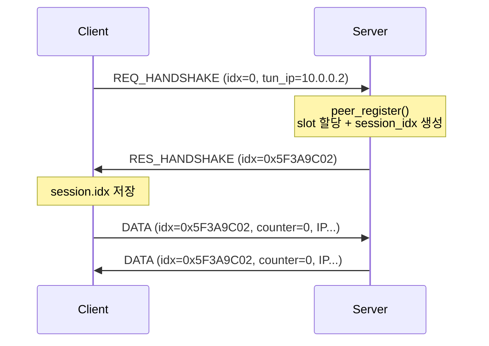
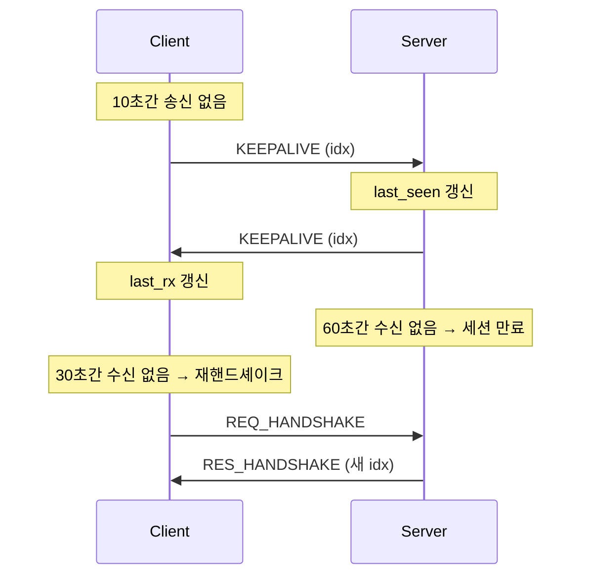

# my_vpn

> C로 처음부터 만드는 L3 VPN — TUN 인터페이스 + UDP 터널 + 세션 기반 피어 관리 + ACL

리눅스 TUN 디바이스로 IP 패킷을 가로채고, 직접 설계한 헤더를 붙여 UDP로 터널링하는 VPN입니다.
외부 VPN 라이브러리 없이 **패킷 포맷, 핸드셰이크, 세션 관리, 접근 제어**를 단계별로 구현하며
Zero Trust Network Access(ZTNA)의 기반 구조를 학습하는 것을 목표로 합니다.

```
 ┌──────────── Client ────────────┐                 ┌──────────── Server ────────────┐
 │  app ──▶ kernel ──▶ tun0       │                 │       tun ──▶ kernel ──▶ app   │
 │                      │         │   UDP :9000     │        ▲                        │
 │              [hdr 16B | IP] ───┼────────────────▶│ verify ┼─ peer table ─ ACL     │
 │                                │◀────────────────┼── [hdr 16B | IP]               │
 └────────────────────────────────┘                 └────────────────────────────────┘
```

---

## Features

- **TUN 기반 L3 터널링** — `IFF_TUN | IFF_NO_PI`로 순수 IPv4 패킷만 송수신
- **자체 와이어 프로토콜** — 버전/타입/세션 idx를 담은 고정 길이 헤더, 빅엔디언 직렬화
- **핸드셰이크 & 세션 idx** — 서버가 클라이언트별로 추측하기 어려운 32bit 세션 식별자 발급
- **피어 테이블** — O(1) 세션 조회, 테이블이 가득 차면 LRU 방식으로 교체
- **ACL** — `src / dst / proto / dport` 기반 first-match 정책, 기본 거부(default deny)
- **위조 방어** — 서버는 inner src가 세션에 등록된 터널 IP와 같은지, 클라이언트는 출발지가 서버인지 확인
- **Keepalive & 세션 만료** — 유휴 시 10초마다 keepalive, 서버는 60초 무응답 세션을 정리
- **재핸드셰이크** — 클라이언트가 30초간 서버 응답이 없으면 스스로 세션을 다시 맺음
- **epoll 단일 스레드 이벤트 루프** — TUN fd와 UDP 소켓을 하나의 루프에서 처리
- **헤드룸 기반 버퍼 설계** — 헤더 자리를 비워두고 읽어 송신 경로에서 추가 memcpy 없음

---

## Protocol

### Wire format

모든 UDP 페이로드는 `msg_header`로 시작하며, 데이터 메시지는 그 뒤에 `data_header`와 원본 IP 패킷이 붙습니다.

```
 0        1        2                 4                                   8
 +--------+--------+-----------------+-----------------------------------+
 | version|  type  |    reserved     |         session_idx (BE)          |  msg_header  (8B)
 +--------+--------+-----------------+-----------------------------------+
 |                         counter (BE, 64bit)                           |  data_header (8B)
 +-----------------------------------------------------------------------+
 |                        inner IPv4 packet ...                          |  payload
 +-----------------------------------------------------------------------+
 \__________________________ PKT_HDR_LEN = 16 __________________________/
```

| type | 값 | 페이로드 |
|---|---|---|
| `MSG_TYPE_REQ_HANDSHAKE` | 1 | `msg_header` + 클라이언트 터널 IP (4B) |
| `MSG_TYPE_RES_HANDSHAKE` | 2 | `msg_header` (발급된 `session_idx` 포함) |
| `MSG_TYPE_DATA` | 3 | `msg_header` + `data_header` + IP 패킷 |
| `MSG_TYPE_KEEPALIVE` | 4 | `msg_header`만 (8B) |

- 헤더 크기는 `_Static_assert`로 컴파일 타임에 8바이트임을 보장합니다.
- 정수 필드는 `msg_encode` / `data_encode`에서 네트워크 바이트 순서로 변환합니다.

### Handshake



- 클라이언트는 1초 타임아웃으로 최대 5회 재전송하며, 서버 주소에서 온 응답만 받습니다.
- 같은 터널 IP가 같은 외부 주소에서 다시 요청하면 서버는 기존 세션의 idx를 그대로 돌려줍니다.

### Keepalive & session lifetime



| 상수 (`proto.h`) | 값 | 의미 |
|---|---|---|
| `KEEPALIVE_INTERVAL_SEC` | 10 | 클라이언트가 이 시간 동안 아무것도 보내지 않았으면 keepalive 전송 |
| `SERVER_TIMEOUT_SEC` | 30 | 클라이언트가 이 시간 동안 서버에서 아무것도 받지 못하면 재핸드셰이크 |
| `SESSION_TIMEOUT_SEC` | 60 | 서버가 이 시간 동안 수신이 없는 세션을 만료 |

- keepalive는 NAT 매핑 유지와 생존 확인을 겸합니다. 서버는 받은 keepalive에 같은 형식으로 응답합니다.
- 서버가 재시작했거나 세션이 만료된 경우 서버는 옛 idx의 패킷을 버리고, 클라이언트는 응답이 끊긴 것을 감지해 새 세션을 받습니다.
- 재핸드셰이크로 idx가 바뀌면 클라이언트는 `tx_counter`를 0으로 되돌립니다. idx가 그대로면 세션이 이어지는 것이므로 유지합니다.

### Session index

```
 31                                   8 7          0
 +-------------------------------------+------------+
 |        random (getrandom, 24bit)    | slot (8bit)|
 +-------------------------------------+------------+
```

- 하위 8비트가 피어 테이블 slot이므로 서버는 **배열 인덱싱 한 번**으로 세션을 찾습니다.
- 상위 24비트 난수와 전체 값 비교로, 같은 slot을 재사용해도 이전 세션 idx는 무효가 됩니다.
- `MAX_PEERS <= 2^8`은 `_Static_assert`로 강제합니다.

---

## Packet flow

### 송신: TUN → UDP

TUN에서 읽을 때 버퍼 앞 16바이트를 **비워두고** 읽은 뒤, 그 자리에 헤더만 채워 그대로 전송합니다.

```
read(tun, buf + 16)     [ ........ 16B ........ ][ IP packet (n) ]
msg_encode(buf)         [ msg_hdr ][ ... 8B ... ][ IP packet (n) ]
data_encode(buf + 8)    [ msg_hdr ][ data_hdr  ][ IP packet (n) ]
sendto(buf, 16 + n)     └──────────── 한 번에 전송 ─────────────┘
```

- 서버는 inner IP의 **목적지 주소**로 피어를 찾아 해당 피어의 외부 주소로 보냅니다.

### 수신: UDP → TUN

```
recvfrom(buf)           [ msg_hdr ][ data_hdr  ][ IP packet ]
msg_decode   → off = 8      │ version / type / session_idx 검증
data_decode  → off = 16                │ counter
write(tun, buf + 16, n - 16)                       └─ 커널로 전달
```

서버 측 검증 순서:

1. 헤더 길이 / 프로토콜 버전
2. 핸드셰이크 요청이면 `handle_handshake`로 분기
3. `session_idx`로 피어 조회 (`peer_find_idx`)
4. 메시지 타입 분기 (keepalive → `last_seen` 갱신 후 응답)
5. `data_header` 및 IPv4 형식 검사
6. inner src가 피어의 터널 IP와 같은지 검사
7. ACL 정책 검사 (활성화 시)
8. 모든 검사를 통과한 뒤에만 피어의 외부 주소와 `last_seen` 갱신 (`peer_touch`)

클라이언트 측 검증 순서:

1. 출발지 주소/포트가 서버와 같은지
2. 헤더 길이 / 프로토콜 버전
3. `session_idx`가 자신의 세션과 같은지
4. 메시지 타입 분기, `data_header` 및 IPv4 형식 검사

---

## Build

```bash
make            # lib + client + server
make clean      # 오브젝트/산출물 삭제
make distclean  # bin/ 디렉터리 전체 삭제
```

- 요구사항: Linux, GCC, `/dev/net/tun`
- `-Wall -Wextra` 경고 없이 빌드됩니다.

| 산출물 | 경로 |
|---|---|
| 공용 라이브러리 | `lib/common/bin/libcommon.a` |
| 클라이언트 | `client/bin/vpn_client` |
| 서버 | `server/bin/vpn_server` |

---

## Usage

TUN 디바이스 생성에 root 권한(`CAP_NET_ADMIN`)이 필요합니다.

### Server

```bash
sudo ./server/bin/vpn_server <port> [acl-file]

# 다른 터미널에서 인터페이스 설정 (생성된 이름은 로그의 "tun device:" 확인)
sudo ip addr add 10.0.0.1/24 dev tun0
sudo ip link set tun0 mtu 1400 up
```

### Client

```bash
sudo ./client/bin/vpn_client <ifname> <server-ip> <port> <tunnel-ip>
# 예) sudo ./client/bin/vpn_client tun0 203.0.113.10 9000 10.0.0.2

sudo ip addr add 10.0.0.2/24 dev tun0
sudo ip link set tun0 mtu 1400 up
```

- `<tunnel-ip>`는 인터페이스에 할당한 주소와 같아야 합니다. 서버는 이 주소로 응답 패킷의 목적지 피어를 찾습니다.
- MTU 1400은 외부 IP(20) + UDP(8) + 터널 헤더(16)를 고려한 값입니다.

### Test

```bash
ping 10.0.0.1     # client → server
```

```
[HS] request 1/5
[HS] established idx=5f3a9c02
[tun0][tun->udp] 84 bytes, proto=1, icmp type=8
[tun0][udp->tun] 84 bytes, proto=1, icmp type=0
```

### Test scripts

`test/`의 스크립트는 빌드, 실행, 인터페이스 설정(IP/MTU)을 한 번에 하고 시나리오별로 `PASS` / `FAIL`을 출력합니다.
서버 장비에서 먼저 실행한 뒤 클라이언트 장비에서 실행합니다.

| 시나리오 | 서버 | 클라이언트 | 확인하는 것 |
|---|---|---|---|
| 기본 연결 | `test/server.sh` | `test/client.sh` | 핸드셰이크와 ping 왕복 |
| 유휴 120초 | `test/server.sh` | `test/client.sh idle` | keepalive로 세션이 유지되고 재핸드셰이크가 발동하지 않음 |
| 클라이언트 정지 70초 | `test/server.sh` | `test/client.sh stop` | 서버의 세션 만료, 클라이언트의 재핸드셰이크 |
| 서버 재시작 | `test/server.sh restart` | `test/client.sh restart` | 서버 `kill -9` 후 재시작 시 새 세션으로 복구 |

```bash
SERVER_IP=203.0.113.10 test/client.sh idle    # 설정은 환경변수로 변경 (기본값은 test/common.sh)
```

Windows 클라이언트는 `windows/test/client.ps1`이 같은 시나리오를 돌립니다. 빌드 → 권한 상승(UAC) →
실행 → 판정까지 한 번에 하고, 결과는 `windows/test/logs/`에 남습니다.

| 시나리오 | 서버 (Linux) | 클라이언트 (Windows) |
|---|---|---|
| 기본 연결 | `test/server.sh` | `windows\test\client.ps1` |
| 유휴 120초 | `test/server.sh` | `windows\test\client.ps1 idle` |
| 서버 재시작 | `test/server.sh restart` | `windows\test\client.ps1 restart` |

```powershell
$env:SERVER_IP='203.0.113.10'; windows\test\client.ps1 idle -Sec 180
```

- 터널 IP 기본값은 `10.0.0.3`입니다 (`10.0.0.2`는 Linux 클라이언트가 씁니다).
- 유휴 시나리오는 재핸드셰이크가 없었는지만 보지 않고, keepalive가 실제로 나가고 **서버 응답이 돌아왔는지**까지 확인합니다.
- 종료는 Ctrl-C 경로(`GenerateConsoleCtrlEvent`)로 보내 어댑터와 터널 IP가 스스로 정리되는지도 함께 봅니다.

- 로그는 `test/logs/`에도 저장됩니다.
- 서버 장비에 클라이언트 터널 IP가 로컬 주소로 남아 있으면(이전 테스트의 persistent tun 등) 커널이 터널로 들어온 패킷을 버리므로, 서버 스크립트가 시작 전에 이를 검사합니다.

---

## Windows client

`windows/`에 같은 와이어 프로토콜을 쓰는 Windows용 클라이언트가 있습니다. 서버는 Linux 그대로이며,
프로토콜 코드(`lib/common`의 `proto.h` / `proto.c`)는 Linux와 Windows가 같은 소스를 빌드합니다.

| | Linux (`client/`) | Windows (`windows/`) |
|---|---|---|
| 가상 인터페이스 | `/dev/net/tun` fd, `read` / `write` | [Wintun](https://www.wintun.net/) 링버퍼, `WintunReceivePacket` / `WintunSendPacket` |
| 이벤트 루프 | `epoll_wait` | `WaitForMultipleObjects` (종료 이벤트 + Wintun read 이벤트 + `WSAEventSelect` 소켓 이벤트) |
| 핸드셰이크 대기 | `SO_RCVTIMEO` 블로킹 `recvfrom` | 같은 이벤트 대기 — 대기 중에도 종료 요청에 바로 반응 |
| 종료 | `SIGINT` / `SIGTERM` | manual-reset 이벤트 (콘솔은 Ctrl+C, GUI는 해제 버튼) |
| 시간 | `clock_gettime`, `time` | `GetTickCount64` |
| IP / MTU 설정 | `ip addr add`, `ip link set mtu` | 프로그램이 직접 설정 (`CreateUnicastIpAddressEntry`, `SetIpInterfaceEntry`) |
| keepalive 트리거 | 송신 유휴 10초 | 송신 유휴 10초 **또는** 수신 유휴 10초 (아래 참고) |
| 터널에 넣지 않는 패킷 | — (tun0이 조용함) | 멀티캐스트 / 브로드캐스트 목적지 |

- 터널 로직은 `core/tunnel.c`의 블로킹 함수 `tunnel_run()` 하나이고, 로그와 상태 변화는 콜백으로 알립니다.
  콘솔 클라이언트는 이를 메인 스레드에서, GUI는 `core/vpn_session.c`를 통해 워커 스레드에서 호출합니다.
- Windows의 UDP 소켓은 ICMP port unreachable을 받으면 다음 `recvfrom`이 `WSAECONNRESET`으로 실패합니다.
  서버가 내려가 있는 동안에도 재핸드셰이크를 계속 시도해야 하므로 `SIO_UDP_CONNRESET`으로 이 동작을 끕니다.
- Wintun은 패킷을 링버퍼 안에서 직접 넘겨주므로 Linux의 헤드룸 방식을 쓸 수 없어, 송신 경로에서 한 번 복사합니다.

#### Windows는 터널 어댑터에도 계속 말을 건다

Linux의 `tun0`은 아무도 쓰지 않으면 조용하지만, Windows는 어댑터가 올라오는 순간부터 그 인터페이스로
mDNS / LLMNR / SSDP / IGMP를 꾸준히 내보냅니다. 서버는 inner dst로 피어를 1:1로 찾으므로
멀티캐스트·브로드캐스트는 애초에 전달할 상대가 없는데, 이를 그대로 터널에 넣으면

1. 서버는 받아서 자기 tun에 쓰고 커널이 버리므로 **응답이 돌아오지 않고**,
2. 송신이 10초 안에 계속 일어나 `last_tx` 기준 keepalive가 **영구히 억제**되어,
3. 수신이 끊긴 것으로 판정되어 서버가 살아 있는데도 **30초마다 재핸드셰이크**가 돕니다.

실제로 120초 유휴 테스트에서 재현했습니다 (유휴 120초 동안 `tun->udp` 58개 / `udp->tun` 0개 → 재핸드셰이크 1회).
두 군데를 고쳤습니다.

- 송신 경로에서 목적지가 멀티캐스트(`224.0.0.0/4` 이상)이거나 터널 대역의 브로드캐스트면 버립니다.
  서버가 버릴 패킷을 보내지 않으니 대역과 서버 처리도 함께 아낍니다.
- keepalive가 맡은 두 가지를 분리했습니다. **NAT 매핑 유지**는 송신 유휴 10초 기준 그대로 두고,
  **생존 확인**은 "서버가 10초간 조용하면 보낸다"를 따로 둡니다. 데이터 패킷은 서버가 버릴 수 있어
  응답을 보장하지 못하지만 keepalive는 서버가 반드시 되돌려주므로, 응답 없는 송신이 이어져도
  재핸드셰이크 전에 생존 여부를 확인할 수 있습니다.

### GUI (MFC)

`gui/`는 `core/vpn_session.c` 위에 올린 MFC 다이얼로그입니다. `tunnel_run()`이 블로킹 함수이므로
UI 스레드에서 부를 수 없고, 워커 스레드에서 돌리면서 스레드 경계를 넘겨야 합니다.

| 문제 | 처리 |
|---|---|
| 콜백이 워커 스레드에서 불린다 | 컨트롤을 직접 건드리지 않고 `PostMessage`로 UI 스레드에 넘김 |
| `SendMessage`를 쓰면? | UI 스레드가 워커 종료를 기다리는 중이면 서로를 기다리는 교착. `PostMessage`는 큐에 넣고 바로 복귀 |
| 로그 문자열 수명 | 워커가 힙에 복사해 소유권을 메시지에 실어 넘기고, UI가 처리 후 해제. `PostMessage` 실패 시 보낸 쪽이 해제 |
| 창을 닫을 때 | 종료 요청 → 워커 join → **그 다음** 큐에 남은 로그 버퍼 해제 (순서가 바뀌면 샘) |
| 해제 버튼 | 요청만 하고 기다리지 않음. 워커가 끝나면 오는 `WM_VPN_DONE`에서 join (UI가 멈추지 않음) |
| 강제 종료 | `TerminateThread`를 쓰지 않음. 정리 구간이 돌지 못하면 어댑터와 터널 IP가 남음 |

### Build & run

1. [wintun.net](https://www.wintun.net/)에서 Wintun zip을 받아 `windows/third_party/`에 풉니다.
   (`windows/third_party/wintun/include/wintun.h`, `windows/third_party/wintun/bin/amd64/wintun.dll`)
2. Visual Studio 2022 이상으로 `windows/my_vpn.sln`을 열어 x64로 빌드합니다. `wintun.dll`은 빌드 후 실행 파일 옆으로 복사됩니다.
   GUI(`vpn_gui`)는 Visual Studio 설치 관리자의 개별 구성 요소에서 **"최신 v143(또는 v145) 빌드 도구용 C++ MFC"** 가 필요합니다
   (없으면 `error MSB8041`). 콘솔 클라이언트(`vpn_client`)는 MFC 없이 빌드됩니다.
3. **관리자 권한**으로 실행합니다. 어댑터 생성과 IP / MTU 설정까지 프로그램이 합니다.
   GUI는 매니페스트에 `requireAdministrator`가 박혀 있어 실행할 때 Windows가 권한 상승을 먼저 묻습니다.

```
:: 콘솔
windows\build\Debug\vpn_client.exe <adapter-name> <server-ip> <port> <tunnel-ip>
:: 예) vpn_client.exe my_vpn 203.0.113.10 9000 10.0.0.3

:: GUI — 같은 값을 창에서 입력하고 [연결]
windows\build\Debug\vpn_gui.exe
```

- 터널 대역은 `/24`로 설정합니다. 온링크 라우트(`10.0.0.0/24`)는 주소를 붙이면 Windows가 직접 넣어주므로 따로 추가하지 않습니다.
- 플랫폼 툴셋은 하드코딩하지 않고 설치된 VS의 기본값(`$(DefaultPlatformToolset)` — VS2022는 v143, VS2026은 v145)을 따릅니다.
- 소스는 Linux와 함께 쓰므로 UTF-8(BOM 없음)입니다. MSVC는 기본적으로 시스템 코드페이지로 읽어 C4819가 나고
  한글 와이드 문자열 리터럴도 깨지므로 `/utf-8`로 컴파일합니다. `.rc`는 `#pragma code_page(65001)`로 같은 문제를 막습니다.
- 경로 기준은 `$(MSBuildProjectDirectory)`입니다. `$(SolutionDir)`은 `.sln`을 통해 빌드할 때만 정의되므로,
  `msbuild windows\cli\vpn_client.vcxproj`처럼 프로젝트를 직접 빌드해도 되도록 쓰지 않습니다.
- 서버에서 Windows 클라이언트로 ping을 보내려면 Windows 방화벽에서 ICMPv4 인바운드를 허용해야 합니다.

---

## ACL

규칙 파일은 한 줄에 하나씩, **위에서부터 처음 일치한 규칙**이 적용되며 일치하는 규칙이 없으면 거부합니다.

```
# src           dst            proto   dport        action
10.0.0.0/24     10.0.0.1       icmp    any          allow
10.0.0.0/24     10.0.0.1       tcp     22           allow
10.0.0.0/24     10.0.0.1       tcp     8000-8080    allow
any             any            any     any          deny
```

| 필드 | 형식 |
|---|---|
| src / dst | `a.b.c.d`, `a.b.c.d/n`, `any` |
| proto | `icmp`, `tcp`, `udp`, `any`, 또는 숫자 |
| dport | `n`, `lo-hi`, `any`, `-` (tcp/udp에만 적용) |
| action | `allow`, `deny` |

- 최대 32개 규칙, `#` 이후는 주석입니다.
- 현재는 클라이언트 → 서버 방향(UDP → TUN)에 적용됩니다.

---

## Project structure

```
my_vpn/
├── lib/common/            # 클라이언트/서버 공용
│   ├── include/proto.h    #   와이어 헤더 정의, IP 오프셋 매크로 (Linux / Windows 공용)
│   ├── include/common.h   #   Linux 전용 선언 (proto.h 포함)
│   └── src/
│       ├── proto.c        #   encode/decode (Linux / Windows 공용)
│       └── common.c       #   tun_alloc, hex_dump
├── client/
│   └── src/client.c       # 핸드셰이크, keepalive, 재핸드셰이크 + epoll 터널 루프
├── server/
│   ├── include/{peer,acl}.h
│   └── src/
│       ├── server.c       # epoll 루프, 핸드셰이크/keepalive 처리, 패킷 검증
│       ├── peer.c         # 피어 테이블, 세션 idx 발급/조회, 세션 만료
│       └── alc.c          # ACL 파싱 및 매칭
├── windows/               # Windows 클라이언트 (Visual Studio 솔루션)
│   ├── my_vpn.sln
│   ├── core/
│   │   ├── tunnel.{h,c}       # Wintun + Winsock 터널 루프 (블로킹 tunnel_run)
│   │   └── vpn_session.{h,c}  # 워커 스레드 + PostMessage 마셜링 (UI 프레임워크 비의존)
│   ├── cli/               #   콘솔 클라이언트 (main.c)
│   └── gui/               #   MFC 다이얼로그 (VpnGuiApp, MainDlg, vpn_gui.rc)
├── test/
│   ├── common.sh          # 공용 설정 및 함수
│   ├── server.sh          # 서버 실행 / 재시작 시나리오
│   └── client.sh          # 클라이언트 실행 / idle·stop·restart 시나리오
└── Makefile               # 컴포넌트별 bin/ 분리 빌드, 의존성 자동 추적
```

---

## Security model

현재 단계에서 무엇을 막고, 무엇을 아직 막지 못하는지 명시합니다.

| 위협 | 상태 | 비고 |
|---|---|---|
| 등록되지 않은 클라이언트의 데이터 주입 | 방어 | 유효한 `session_idx` 필요 |
| 오래된 세션 idx 재사용 | 방어 | slot 재사용 시 난수 부분 변경 |
| 정책 외 목적지 접근 | 방어 | ACL default deny |
| 세션 내 inner src IP 위조 | 방어 | inner src가 피어의 터널 IP와 다르면 폐기 |
| 클라이언트의 비서버 출발지 패킷 수신 | 방어 | 출발지 주소/포트가 서버와 다르면 폐기 |
| 죽은 세션이 테이블을 계속 점유 | 방어 | 60초 무응답 세션 만료 |
| 도청 / idx 탈취 | **미방어** | 평문 프로토콜 — idx를 아는 공격자는 패킷 주입과 외부 주소 변경이 가능. 암호화 단계에서 해결 |
| 핸드셰이크 위장 (세션 탈취) | **미방어** | 터널 IP만 알면 누구나 세션을 받을 수 있음. 인증 단계에서 해결 |
| 재전송 공격 | **미방어** | `counter`는 송신만 하고 수신 측 검증 없음. 인증 없이는 값 변조가 가능해 암호화와 함께 추가 예정 |

> 학습 목적의 프로젝트이며, 프로덕션 환경에서 사용하기 위한 보안 수준이 아닙니다.

### Known limitations

- **재핸드셰이크는 블로킹입니다.** 메인 루프 안에서 응답을 최대 5초 기다리며, 그동안 터널 패킷은 처리되지 않습니다. 실패하면 30초 뒤에 다시 시도합니다.
- **종료 통지가 없습니다.** 클라이언트가 종료해도 서버는 알지 못하고, 세션은 60초 뒤 만료로 정리됩니다.
- **세션 만료와 재핸드셰이크 판정은 벽시계(`time()`) 기준입니다.** 시스템 시간이 크게 바뀌면 만료나 재핸드셰이크가 일찍 일어날 수 있습니다.
- **IPv4만 터널링합니다.** IPv6 패킷은 건너뜁니다.
- **멀티캐스트 / 브로드캐스트는 터널을 통과하지 못합니다.** 서버가 inner dst로 피어를 1:1로 찾는 구조라
  전달할 상대가 없습니다. Windows 클라이언트는 이를 송신 경로에서 명시적으로 버립니다.

---

## Roadmap

- [x] TUN 디바이스 + UDP 기본 터널
- [x] 와이어 헤더 설계 및 encode/decode
- [x] 핸드셰이크와 세션 idx 기반 피어 관리
- [x] ACL (default deny)
- [x] 위조 방어 — inner src 검증, 검증 후 NAT 외부 주소 갱신, 클라이언트 출발지 확인
- [x] Keepalive 및 세션 만료
- [x] 클라이언트 재핸드셰이크 (서버 재시작 / 세션 만료 복구)
- [x] 시나리오 테스트 스크립트
- [ ] 암호화 & 키 교환 — X25519 + ChaCha20-Poly1305, `counter`를 nonce 및 재전송 방지에 사용
- [ ] 신원 기반 인증 — 클라이언트 키 인증, 사용자/기기 단위 정책 (ZTNA)
- [ ] 비블로킹 재핸드셰이크 (상태 머신), 종료 통지 메시지
- [ ] Windows 클라이언트 — Wintun 콘솔 클라이언트 (핸드셰이크·ping 왕복 확인, 유휴 시나리오 재검증 중)
- [ ] Windows 클라이언트 — MFC GUI (구현, x64 Debug/Release 빌드 확인, 실행 검증 남음)
- [ ] Windows 클라이언트 — Windows 서비스 + Named Pipe IPC

---

## AI 사용 내역

이 프로젝트는 학습이 목적이므로, AI(Claude Code)를 어디에 썼는지 구분해서 밝힙니다.

| 구분 | 내용 |
|---|---|
| 직접 구현 | 와이어 프로토콜, 핸드셰이크, 피어 테이블, 위조 방어, keepalive, 세션 만료, 재핸드셰이크 등 클라이언트/서버 기능 로직 |
| AI 리뷰 | 위 구현의 diff를 AI에게 검토받고, 지적받은 버그는 직접 수정 |
| AI 작성 | `test/` 테스트 스크립트 전체 |
| AI 작성 (일부) | `client.c`의 재핸드셰이크 로그, `do_handshake`의 `SO_RCVTIMEO` 원복과 `tx_counter` 리셋 |
| AI 작성 | `windows/` Windows 클라이언트 전체 — `core/tunnel.c`(Wintun 터널 루프), `core/vpn_session.c`(워커 스레드/메시지 마셜링), `cli/`(콘솔), `gui/`(MFC 다이얼로그), Visual Studio 프로젝트 파일. Linux 클라이언트의 프로토콜 동작을 기준으로 작성 |
| AI 작성 | `proto.h` / `proto.c` 분리 (기존 코드 이동) |
| AI 분석 | Windows 유휴 시 비유니캐스트 송신이 keepalive를 억제해 불필요한 재핸드셰이크가 생기는 문제를 테스트로 재현하고 `windows/` 쪽을 수정 |
| AI 초안 | 이 README의 keepalive/재핸드셰이크 이후 갱신분 |
