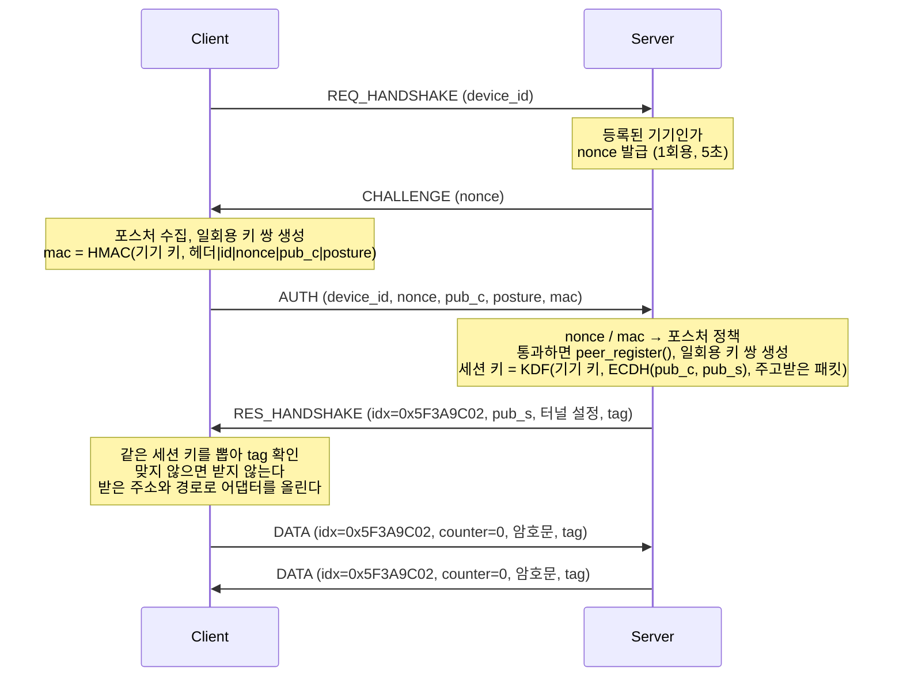
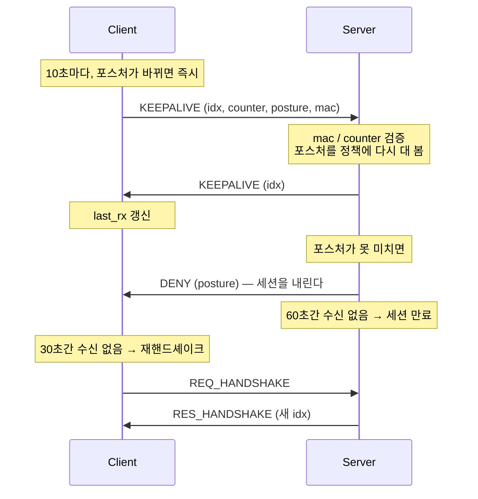

# my_vpn

[](https://github.com/k1msatgat/my_vpn/actions/workflows/ci.yml)

> C로 처음부터 만드는 L3 VPN — TUN 인터페이스 + UDP 터널 + 기기 인증 + 포스처 기반 접근 제어 + ACL

리눅스 TUN 디바이스로 IP 패킷을 가로채고, 직접 설계한 헤더를 붙여 UDP로 터널링하는 VPN입니다.
외부 VPN 라이브러리 없이 **패킷 포맷, 핸드셰이크, 세션 관리, 접근 제어**를 단계별로 구현하며
Zero Trust Network Access(ZTNA)의 기반 구조를 학습하는 것을 목표로 합니다.

```
 ┌──────────── Client ────────────┐                 ┌──────────── Server ────────────┐
 │  app ──▶ kernel ──▶ tun0       │                 │       tun ──▶ kernel ──▶ app   │
 │                      │         │   UDP :9000     │        ▲                        │
 │              [hdr 16B | IP] ───┼────────────────▶│ verify ┼─ peer table ─ ACL     │
 │                                │◀────────────────┼── [hdr 16B | IP]               │
 └────────────────────────────────┘                 └────────────────────────────────┘
```

---

## 문서

| | 내용 |
|---|---|
| 이 문서 | 설계 — 와이어 프로토콜, 패킷 흐름, 보안 모델, 로드맵 |
| [docs/linux.md](docs/linux.md) | Linux 서버·클라이언트 빌드와 실행, 시나리오 테스트, ACL |
| [docs/mcp.md](docs/mcp.md) | MCP 서버 — AI 클라이언트가 Linux 서버를 올리고 내리고, 기기·ACL을 바꾸고, 상태를 본다 |
| [windows/README.md](windows/README.md) | Windows 클라이언트 — Wintun, 이벤트 루프, MFC GUI와 패킷 분석기 |

프로토콜 코드(`lib/common`의 `proto.h` / `proto.c`)는 Linux와 Windows가 같은 소스를 빌드합니다.
플랫폼별로 갈라지는 것만 위 두 문서로 내렸습니다.

---

## Features

- **TUN 기반 L3 터널링** — `IFF_TUN | IFF_NO_PI`로 순수 IPv4 패킷만 송수신
- **자체 와이어 프로토콜** — 버전/타입/세션 idx를 담은 고정 길이 헤더, 빅엔디언 직렬화
- **핸드셰이크 & 세션 idx** — 서버가 클라이언트별로 추측하기 어려운 32bit 세션 식별자 발급
- **기기 인증** — 등록된 기기만 세션을 받는다. 기기별 키로 서버의 nonce에 HMAC-SHA256 서명 (챌린지-응답)
- **세션 암호화** — 핸드셰이크마다 일회용 ECDH(P-256)로 키를 합의하고, 세션의 모든 패킷을 AES-256-GCM으로 감싼다. 내용은 보이지 않고, 고치거나 다시 보낸 패킷은 열리지 않는다
- **서로를 확인** — 세션 키에 기기 키가 들어간다. 그 키를 모르는 쪽은 서버인 척해도 클라이언트가 받아들일 수락을 만들지 못한다
- **서버가 내려 주는 터널 설정** — 터널 주소와 터널로 보낼 대역을 클라이언트에 적지 않는다. 서버가 기기 목록과 ACL에서 뽑아 내려 주고, 정책을 고치면 붙어 있는 기기의 경로가 다음 keepalive에서 따라 바뀐다
- **서버 뒤의 네트워크로 전달** — ACL에 적어서 연 대역만 터널을 지나 서버 뒤로 나간다. 규칙이 없으면 터널 대역 안까지만. 반대 방향은 안에서 시작한 연결의 답만 들인다
- **포스처 기반 접근 제어** — 클라이언트가 OS 빌드 / 방화벽 / 백신 상태를 보고하고, 서버가 기기별 정책에 대 본다
- **지속 검증** — keepalive마다 포스처를 다시 보고·평가하고, 정책에 못 미치면 세션 중에도 차단
- **정책 무중단 변경** — `kill -HUP`으로 기기 목록과 ACL을 다시 읽는다. 지워진 기기는 다음 keepalive에서 끊기고, 새 ACL은 다음 패킷부터 적용된다
- **피어 테이블** — O(1) 세션 조회, 테이블이 가득 차면 LRU 방식으로 교체
- **ACL** — `src / dst / proto / dport` 기반 first-match 정책, 기본 거부(default deny)
- **리소스별 포스처 조건** — ACL 규칙마다 요구하는 포스처를 따로 건다. 터널에 들어온 기기라도 방화벽을 끄면 SSH 같은 민감한 목적지만 닫힌다
- **상태 소켓** — 지금 붙어 있는 세션(기기, 포스처, 트래픽)과 사유별 거부 횟수를 읽기 전용 유닉스 소켓으로 내보낸다
- **감사 로그** — 누가 언제 들어와 어디에 닿았고 왜 거절됐는지를 사건마다 한 줄씩 JSON으로 남긴다. 패킷마다가 아니라 세션과 목적지마다 한 번
- **등록 코드** — 기기의 ID와 키를 손으로 옮기지 않는다. 관리자가 만든 일회용 코드를 기기에 적으면 기기가 자기 키를 암호화된 세션으로 서버에 올린다
- **서비스와 GUI의 분리 (Windows)** — 터널은 시스템 서비스가 맡고 GUI는 권한 없이 떠서 파이프로 조종한다. 창을 닫아도 터널이 유지되고, 기기의 키는 서비스만 읽는다
- **MCP 제어** — AI 클라이언트가 서버를 올리고 내리고, 기기와 ACL을 바꾸고, 상태를 본다 ([docs/mcp.md](docs/mcp.md))
- **위조 방어** — 서버는 inner src가 세션에 등록된 터널 IP와 같은지, 클라이언트는 출발지가 서버인지 확인
- **Keepalive & 세션 만료** — 유휴 시 10초마다 keepalive, 서버는 60초 무응답 세션을 정리
- **재핸드셰이크** — 클라이언트가 30초간 서버 응답이 없으면 스스로 세션을 다시 맺음
- **epoll 단일 스레드 이벤트 루프** — TUN fd와 UDP 소켓을 하나의 루프에서 처리
- **헤드룸 기반 버퍼 설계** — 헤더 자리를 비워두고 읽어 송신 경로에서 추가 memcpy 없음

---

## Protocol

### Wire format

모든 UDP 페이로드는 `msg_header`로 시작합니다. 세션이 열린 뒤의 패킷은 종류와 관계없이 같은 모양입니다.

```
 0        1        2                 4                                   8
 +--------+--------+-----------------+-----------------------------------+
 | version|  type  |    reserved     |         session_idx (BE)          |  msg_header  (8B)  ┐ 암호화하지 않지만
 +--------+--------+-----------------+-----------------------------------+                    │ tag 가 함께 덮는다
 |                         counter (BE, 64bit)                           |  data_header (8B)  ┘
 +-----------------------------------------------------------------------+
 |                  암호문 (AES-256-GCM) ...                             |  DATA: inner IPv4 패킷
 +-----------------------------------------------------------------------+
 |                         tag (16B)                                     |
 +-----------------------------------------------------------------------+
 \________________ PKT_OVERHEAD = 16 (헤더) + 16 (tag) _________________/
```

| type | 값 | 페이로드 |
|---|---|---|
| `MSG_TYPE_REQ_HANDSHAKE` | 1 | `msg_header` + 기기 ID (16B) |
| `MSG_TYPE_RES_HANDSHAKE` | 2 | `msg_header` (발급된 `session_idx` 포함) + 서버의 일회용 공개키 (64B) + 암호화된 터널 설정 + tag (16B) |
| `MSG_TYPE_DATA` | 3 | 세션 패킷. 암호문 = IP 패킷 |
| `MSG_TYPE_KEEPALIVE` | 4 | 세션 패킷. C→S: 암호문 = 포스처 (8B) / S→C: 암호문 = 지금의 터널 설정 |
| `MSG_TYPE_CHALLENGE` | 5 | `msg_header` + nonce (16B) |
| `MSG_TYPE_AUTH` | 6 | `msg_header` + 기기 ID (16B) + nonce (16B) + 클라이언트의 일회용 공개키 (64B) + 포스처 (8B) + mac (32B) |
| `MSG_TYPE_DENY` | 7 | 핸드셰이크 중 (`session_idx` = 0): `msg_header` + 사유 (1B) + mac (32B) / 세션 중: 세션 패킷, 암호문 = 사유 (1B) |
| `MSG_TYPE_ENROLL` | 8 | 세션 패킷. 등록 코드로 연 세션에서만. C→S: 암호문 = 기기 ID (16B) + 키 (32B) / S→C: 암호문 = 결과 (1B) |

포스처 보고는 8바이트 고정입니다: `os_build`(4B, BE) + `firewall`(1B) + `antivirus`(1B) + 예약(2B).
상태 값은 0 = 모름, 1 = 꺼짐, 2 = 켜짐이며, 채우지 않은 필드가 통과로 읽히지 않도록 0을 "모름"으로 뒀습니다.

- 헤더 크기는 `_Static_assert`로 컴파일 타임에 8바이트임을 보장합니다.
- 정수 필드는 `msg_encode` / `data_encode`에서 네트워크 바이트 순서로 변환합니다.

### Handshake


```mermaid
sequenceDiagram
    participant C as Client
    participant S as Server
    C->>S: REQ_HANDSHAKE (device_id)
    Note over S: 등록된 기기인가<br/>nonce 발급 (1회용, 5초)
    S->>C: CHALLENGE (nonce)
    Note over C: 포스처 수집, 일회용 키 쌍 생성<br/>mac = HMAC(기기 키, 헤더|id|nonce|pub_c|posture)
    C->>S: AUTH (device_id, nonce, pub_c, posture, mac)
    Note over S: nonce / mac → 포스처 정책<br/>통과하면 peer_register(), 일회용 키 쌍 생성<br/>세션 키 = KDF(기기 키, ECDH(pub_c, pub_s), 주고받은 패킷)
    S->>C: RES_HANDSHAKE (idx=0x5F3A9C02, pub_s, 터널 설정, tag)
    Note over C: 같은 세션 키를 뽑아 tag 확인<br/>맞지 않으면 받지 않는다<br/>받은 주소와 경로로 어댑터를 올린다
    C->>S: DATA (idx=0x5F3A9C02, counter=0, 암호문, tag)
    S->>C: DATA (idx=0x5F3A9C02, counter=0, 암호문, tag)
```

어느 단계에서든 서버는 `RES_HANDSHAKE` 대신 `DENY`(사유)로 답할 수 있습니다.

| 사유 | 값 | 뜻 |
|---|---|---|
| `DENY_UNKNOWN_DEVICE` | 1 | 기기 목록에 없는 ID |
| `DENY_BAD_AUTH` | 2 | nonce가 다르거나 만료됐거나 mac이 틀림 |
| `DENY_TUN_IP` | 3 | (버전 3까지) 그 기기에 배정된 터널 IP가 아님. 이제 터널 IP는 서버가 정해 내려 주므로 보내지 않음 |
| `DENY_POSTURE` | 4 | 인증은 됐지만 포스처가 그 기기의 정책에 못 미침 |

- **챌린지-응답**이라 키 자체는 와이어에 나오지 않습니다. nonce는 서명이 맞는 `AUTH`를 받는 순간 버리므로(뒤의 검사에서 거절되더라도) 엿들은 `AUTH`를 다시 보내도 통과하지 못합니다.
- **확인되지 않은 패킷은 진행 중인 핸드셰이크를 건드리지 못합니다.** 살아 있는 nonce가 있는 동안 다시 온 `REQ`에는 같은 nonce를 내주고, 서명이 틀린 `AUTH`는 nonce를 버리지 않습니다. 기기 ID만 아는 제3자가 `REQ`나 엉터리 `AUTH`를 계속 보내 진짜 기기의 핸드셰이크를 깨뜨릴 수 없습니다.
- **포스처는 mac의 서명 범위 안**이라 전달 도중에 "방화벽 꺼짐"을 "켜짐"으로 고칠 수 없습니다.
- **검사 순서**는 기기 → nonce / mac → 포스처입니다. 키를 가졌다는 것을 확인하기 전에는 구체적인 거절 이유를 알려 주지 않습니다.
- 클라이언트는 `AUTH`를 보내기 전에 온 `RES_HANDSHAKE`를 받지 않습니다. 받아 주면 서버인 척하는 쪽이 `REQ`에 곧바로 `RES`를 돌려주는 것만으로 인증 단계가 건너뛰어집니다.
- 클라이언트는 1초 타임아웃으로 최대 5회 `REQ`부터 다시 하며, 서버 주소에서 온 응답만 받습니다.
- 새로 인증하면 새 세션입니다. 서버는 그 터널 IP의 기존 세션을 내리고 새 idx와 새 키를 발급합니다.

### Session encryption

인증만 있던 때에는 "누가 세션을 여는가"는 지켰지만, 열린 뒤의 패킷은 그대로 보였고 세션 번호(4B)만 알면 누구든 끼워 넣을 수 있었습니다. 이제 세션마다 키를 따로 뽑아 모든 패킷을 감쌉니다 ([`secure.h`](lib/common/include/secure.h)).

```
secret = ECDH(이번 핸드셰이크의 일회용 P-256 키 쌍)
prk    = HKDF-Extract(salt = 기기 키, ikm = secret)
keys   = HKDF-Expand(prk, "my_vpn v4 session" | SHA-256(AUTH 패킷 | RES 의 헤더와 pub_s), 96B)
       = C→S 키 | S→C 키 | RES_HANDSHAKE 키
```

| 세션 키에 들어가는 것 | 그래서 |
|---|---|
| 기기 키 | 그 키를 모르는 쪽은 사이에 끼어 자기 일회용 키를 내밀어도 같은 세션 키에 닿지 못합니다. 서버에 인증서를 따로 두지 않아도 `RES_HANDSHAKE`의 tag가 맞았다는 것이 곧 "상대가 이 기기의 키를 아는 서버"라는 증명입니다 |
| 일회용 ECDH | 기기 키가 나중에 새도 그동안 녹화해 둔 트래픽은 풀리지 않습니다. 서버의 기기 목록에는 모든 기기의 키가 있어서, 이것이 없으면 서버가 한 번 뚫리는 날 지난 세션이 전부 풀립니다 |
| 주고받은 패킷의 해시 | 도중에 한 바이트라도 바뀌었으면 양쪽의 키가 달라져 첫 패킷부터 열리지 않습니다 |
| 방향마다 다른 키 | 양쪽이 `counter`를 0부터 세도 같은 (키, nonce)가 생기지 않고, 보낸 패킷을 보낸 쪽으로 되돌려 보내도 열리지 않습니다 |

- **`counter`가 그대로 nonce입니다.** 패킷마다 늘어나고 세션이 바뀌면 키가 바뀌므로 같은 (키, nonce)를 두 번 쓰지 않습니다.
- **다시 보낸 패킷은 받지 않습니다.** 받은 `counter`를 64개 폭의 창으로 기억합니다. UDP는 순서를 바꿔 전달할 수 있어서 "가장 큰 값보다 작으면 버린다"로는 안 되고, 창 안에서 처음 보는 값인지를 따집니다.
- **포스처 보고는 순서대로만 받습니다.** 데이터는 늦게 와도 받지만 보고는 "지금의 상태"라서, 방화벽이 켜져 있던 때의 보고를 길목에서 붙잡아 두었다가 끈 뒤에 풀어 놓는 것을 막아야 합니다.
- **열리지 않은 패킷은 세션의 어떤 상태도 바꾸지 못합니다.** 창에 표시하는 것, 외부 주소를 갱신하는 것, "서버가 살아 있다"고 적는 것 모두 tag를 확인한 뒤에 합니다.
- **세션 중의 `DENY`도 세션 키로 감쌉니다.** 세션 번호를 엿본 제3자가 가짜 거절로 남의 접속을 끊을 수 없습니다.
- **핸드셰이크 중의 `DENY`에는 기기 키로 만든 mac이 붙습니다.** 다만 서명이 맞는 `AUTH`를 받은 뒤의 거절(터널 IP, 포스처)에만 붙일 수 있습니다. 그 전의 거절(모르는 기기, 인증 실패)은 서버가 상대의 키를 확인하지 못한 상태라 mac이 없고, 클라이언트는 이런 거절을 곧바로 믿지 않고 진짜 서버의 답을 끝까지 기다린 뒤 다른 답이 없을 때에만 받아들입니다.
- **알고리즘은 직접 구현하지 않았습니다.** 서버는 OpenSSL, Windows 클라이언트는 OS에 내장된 CNG를 쓰고, 그 위의 프로토콜 코드(`secure.c`)는 양쪽이 같은 파일을 빌드합니다. 양쪽 `selftest`가 같은 표준 벡터(FIPS 180-4, RFC 4231, RFC 5869, GCM 명세, RFC 5903)를 통과하는 것이 서로의 패킷을 열 수 있다는 근거입니다.
- **P-256과 AES-GCM을 고른 기준은 "양쪽 OS가 기본으로 주는가"입니다.** 처음 계획은 X25519 + ChaCha20-Poly1305였지만, CNG에서 ChaCha20-Poly1305는 최근 Windows에만 있고 P-256과 AES-GCM은 버전을 가리지 않고 있습니다. 클라이언트에 암호 라이브러리를 따로 실어 보내는 것보다 OS가 보안 패치와 함께 갱신해 주는 구현을 쓰는 쪽을 골랐습니다.

> **Linux 클라이언트(`client/`)는 인증 이전의 프로토콜에 머물러 있습니다.** 예전 형식의 `REQ_HANDSHAKE`를 보내므로 지금 서버에는 붙지 못하며, 더 발전시킬 계획이 없습니다. 이 프로젝트의 클라이언트는 Windows 쪽이고, 인증 핸드셰이크는 Windows 클라이언트와 `test/auth_check.py`로 확인됩니다.

### Tunnel configuration

터널 주소와 "무엇을 터널로 보낼 것인가"는 클라이언트에 적지 않습니다. 서버가 정책에서 뽑아 내려 주고, 클라이언트는 받은 대로 어댑터를 맞춥니다.

```
tun_ip(4) | prefix_len(1) | n_routes(1) | mtu(2) | n_routes x ( addr(4) | prefix_len(1) )
```

| 값 | 어디서 오는가 |
|---|---|
| 터널 주소 | 기기 목록에 그 기기 앞으로 적힌 주소 |
| 대역의 prefix, MTU | 서버를 띄울 때의 `-n` / `-m` (서버 자신의 tun에 붙인 값) |
| 경로 | ACL에서 그 기기의 터널 주소가 출발지에 걸리는 `allow` 규칙들의 목적지 대역 |

- **전에는 클라이언트가 터널 IP를 직접 적어야 했습니다.** 서버가 이미 아는 값을 사용자가 한 번 더 똑같이 입력하는 것이고, 틀리면 거절당할 뿐이었습니다. 그리고 터널 대역 밖으로는 갈 방법이 없었습니다 — 어떤 목적지를 터널로 보낼지 정하는 곳이 없었기 때문입니다.
- **경로는 ACL에서 뽑습니다.** 어디로 갈 수 있는지는 이미 ACL이 말하고 있습니다. 경로 목록을 따로 두면 둘이 어긋납니다 — 경로는 있는데 규칙이 없어 터널로 들어간 패킷이 버려지거나, 규칙은 있는데 경로가 없어 터널로 가지도 않습니다.
- **빼는 것**: `deny` 규칙, 터널 대역 안의 목적지(주소를 받으면 이미 그리로 갑니다), 목적지가 `any`인 규칙. 마지막은 모든 트래픽을 터널로 보내라는 뜻이 되는데, 그러면 서버가 인터넷으로 나가는 길까지 맡아야 합니다. 접근시킬 대역은 적어서 엽니다.
- **`RES_HANDSHAKE`와 서버의 keepalive 응답에 실립니다.** keepalive마다 통째로 다시 보내므로 클라이언트는 받은 것과 지금 적용한 것을 비교하기만 하면 됩니다. 바뀐 것만 따로 알리는 메시지를 두면, 그 한 통이 사라졌을 때를 위한 확인과 재전송이 필요해집니다.
- **정책을 고치면 붙어 있는 기기가 따라옵니다.** ACL을 고치고 `kill -HUP`하면 다음 keepalive(10초 이내)에서 경로가 더해지거나 빠집니다. 세션은 그대로입니다. 클라이언트는 달라진 경로만 고칩니다 — 통째로 지우고 다시 넣으면 바뀌지 않은 경로까지 잠깐 사라집니다.
- **터널 주소가 바뀐 경우만은 다시 핸드셰이크합니다.** 서버의 세션은 예전 주소로 등록돼 있어서, 어댑터만 새 주소로 바꾸면 보내는 패킷이 "세션의 주소가 아닌 출발지"로 버려집니다.
- **클라이언트는 받은 경로를 그대로 믿지 않습니다.** 서버는 인증된 상대지만, `/0`과 서버 자신의 주소를 덮는 대역은 넣지 않습니다. 뒤의 것을 넣으면 터널 패킷을 싣고 가야 할 길이 터널 자신이 되어 그 순간 연결이 끊깁니다.
- **세션 키로 감싸서 보냅니다.** 그 기기 말고는 읽을 수 없고, 도중에 경로를 끼워 넣을 수도 없습니다.

### Keepalive & session lifetime


```mermaid
sequenceDiagram
    participant C as Client
    participant S as Server
    Note over C: 10초마다, 포스처가 바뀌면 즉시
    C->>S: KEEPALIVE (idx, counter, posture, mac)
    Note over S: mac / counter 검증<br/>포스처를 정책에 다시 대 봄
    S->>C: KEEPALIVE (idx)
    Note over C: last_rx 갱신
    Note over S: 포스처가 못 미치면
    S->>C: DENY (posture) — 세션을 내린다
    Note over S: 60초간 수신 없음 → 세션 만료
    Note over C: 30초간 수신 없음 → 재핸드셰이크
    C->>S: REQ_HANDSHAKE
    S->>C: RES_HANDSHAKE (새 idx)
```

| 상수 (`proto.h`) | 값 | 의미 |
|---|---|---|
| `KEEPALIVE_INTERVAL_SEC` | 10 | 클라이언트의 keepalive(포스처 보고) 주기 |
| `SERVER_TIMEOUT_SEC` | 30 | 클라이언트가 이 시간 동안 서버에서 아무것도 받지 못하면 재핸드셰이크 |
| `SESSION_TIMEOUT_SEC` | 60 | 서버가 이 시간 동안 수신이 없는 세션을 만료 |

- keepalive는 NAT 매핑 유지, 생존 확인, **포스처 재보고**를 겸합니다. 핸드셰이크에서 한 번 통과했다고 세션이 끝날 때까지 믿지 않습니다.
- 클라이언트의 keepalive는 mac이 헤더부터 포스처까지를 덮습니다. 헤더의 `session_idx`가 들어가 다른 세션의 keepalive를 끼워 넣을 수 없고, `counter`가 직전 값보다 커야 해서 방화벽이 켜져 있던 때의 keepalive를 녹화했다가 다시 보낼 수 없습니다.
- 서버는 **버리는 것과 끊는 것을 구분**합니다. mac이 틀렸거나 counter가 예전 값이면 조용히 버리고 세션은 그대로 둡니다 (위조 패킷 하나로 남의 세션을 끊을 수 있어서는 안 됩니다). mac이 맞는데 포스처가 못 미치면 `DENY`로 알리고 세션을 내립니다.
- 거절된 클라이언트는 터널을 닫지 않고 통과만 막은 채, 포스처가 바뀌면 바로, 그렇지 않아도 30초마다 다시 핸드셰이크합니다.
- `kill -HUP`으로 서버가 기기 목록을 다시 읽으면, 조건이 강해졌거나 목록에서 지워진 기기는 다음 keepalive에서 걸러집니다.
- 서버는 세션이 마지막으로 보고한 포스처를 기억해 두고, 포스처 조건이 걸린 ACL 규칙을 그 값으로 판정합니다. 기기 정책은 통과하지만 규칙의 조건에는 못 미치는 경우 세션은 유지되고 그 목적지만 닫힙니다.
- 서버가 재시작했거나 세션이 만료된 경우 서버는 옛 idx의 패킷을 버리고, 클라이언트는 응답이 끊긴 것을 감지해 새 세션을 받습니다.
- 재핸드셰이크로 idx가 바뀌면 클라이언트는 `tx_counter`를 0으로 되돌립니다. idx가 그대로면 세션이 이어지는 것이므로 유지합니다.

### Session index

```
 31                                   8 7          0
 +-------------------------------------+------------+
 |        random (getrandom, 24bit)    | slot (8bit)|
 +-------------------------------------+------------+
```

- 하위 8비트가 피어 테이블 slot이므로 서버는 **배열 인덱싱 한 번**으로 세션을 찾습니다.
- 상위 24비트 난수와 전체 값 비교로, 같은 slot을 재사용해도 이전 세션 idx는 무효가 됩니다.
- `MAX_PEERS <= 2^8`은 `_Static_assert`로 강제합니다.

---

## Packet flow

### 송신: TUN → UDP

TUN에서 읽을 때 버퍼 앞 16바이트를 **비워두고** 읽은 뒤, 그 자리에 헤더만 채워 그대로 전송합니다.

```
read(tun, buf + 16)     [ ........ 16B ........ ][ IP packet (n) ]
msg_encode(buf)         [ msg_hdr ][ ... 8B ... ][ IP packet (n) ]
data_encode(buf + 8)    [ msg_hdr ][ data_hdr  ][ IP packet (n) ]
sendto(buf, 16 + n)     └──────────── 한 번에 전송 ─────────────┘
```

- 서버는 inner IP의 **목적지 주소**로 피어를 찾아 해당 피어의 외부 주소로 보냅니다.

### 수신: UDP → TUN

```
recvfrom(buf)           [ msg_hdr ][ data_hdr  ][ IP packet ]
msg_decode   → off = 8      │ version / type / session_idx 검증
data_decode  → off = 16                │ counter
write(tun, buf + 16, n - 16)                       └─ 커널로 전달
```

서버 측 검증 순서:

1. 헤더 길이 / 프로토콜 버전
2. 핸드셰이크 요청이면 `handle_handshake`로 분기
3. `session_idx`로 피어 조회 (`peer_find_idx`)
4. 메시지 타입 분기 (keepalive → `last_seen` 갱신 후 응답)
5. `data_header` 및 IPv4 형식 검사
6. inner src가 피어의 터널 IP와 같은지 검사
7. ACL 정책 검사 (활성화 시)
8. 모든 검사를 통과한 뒤에만 피어의 외부 주소와 `last_seen` 갱신 (`peer_touch`)

클라이언트 측 검증 순서:

1. 출발지 주소/포트가 서버와 같은지
2. 헤더 길이 / 프로토콜 버전
3. `session_idx`가 자신의 세션과 같은지
4. 메시지 타입 분기, `data_header` 및 IPv4 형식 검사

---

## Project structure

```
my_vpn/
├── lib/common/            # 클라이언트/서버 공용
│   ├── include/proto.h    #   와이어 헤더 정의, IP 오프셋 매크로 (Linux / Windows 공용)
│   ├── include/crypt.h    #   암호 도구의 창구 — 서버는 OpenSSL, Windows 는 CNG 가 채운다
│   ├── include/secure.h   #   세션 키 유도, 패킷 감싸기 / 풀기, 재전송 창
│   ├── include/common.h   #   Linux 전용 선언 (proto.h 포함)
│   └── src/
│       ├── proto.c        #   encode/decode (Linux / Windows 공용)
│       ├── secure.c       #   secure.h 의 구현과 selftest 벡터 (서버 / Windows 공용)
│       └── common.c       #   tun_alloc, hex_dump
├── client/
│   └── src/client.c       # 핸드셰이크, keepalive, 재핸드셰이크 + epoll 터널 루프
├── server/
│   ├── include/{peer,acl,device,auth,policy,status}.h
│   └── src/
│       ├── server.c       # epoll 루프, 인증 핸드셰이크 / keepalive 검증, 패킷 검증
│       ├── peer.c         # 피어 테이블, 세션 idx 발급/조회, 세션 만료
│       ├── device.c       # 등록된 기기 목록, 기기별 포스처 정책
│       ├── enroll.c       # 등록 코드의 대기 목록, 등록된 기기를 기기 목록에 올리기
│       ├── crypt.c        # crypt.h 의 OpenSSL 구현 — SHA-256 / HMAC, ECDH P-256, AES-256-GCM, 난수
│       ├── policy.c       # 포스처 조건의 문법과 판정 (기기 목록과 ACL이 함께 쓴다)
│       ├── status.c       # 상태 소켓 — 세션과 카운터를 JSON으로
│       ├── audit.c        # 감사 로그 — 세션 / 거절 / 접근 판정을 사건마다 한 줄씩
│       └── alc.c          # ACL 파싱 및 매칭, 규칙별 포스처 조건
├── windows/               # Windows 클라이언트 (Visual Studio 솔루션)
│   ├── README.md          #   Windows 클라이언트, GUI, 패킷 분석기
│   ├── my_vpn.sln
│   ├── core/              #   UI 프레임워크에 의존하지 않는 순수 Win32/C
│   │   ├── tunnel.{h,c}       # Wintun + Winsock 터널 루프 (블로킹 tunnel_run)
│   │   ├── posture.{h,c}      # 단말 포스처 수집 (OS 빌드 / 방화벽 / 백신)
│   │   ├── device.{h,c}       # 기기 ID · 키 생성, DPAPI 보관
│   │   ├── crypt.c            # crypt.h 의 CNG 구현 — 서버의 crypt.c 와 같은 선언을 채운다
│   │   ├── ipc.{h,c}          # 서비스와 GUI 사이의 메시지 (이름 있는 파이프)
│   │   ├── vpn_remote.{h,c}   # GUI 쪽: vpn_session.h 를 파이프로 채운다
│   │   └── vpn_session.{h,c}  # 한 프로세스 안에서 터널을 돌리던 계층 (GUI 는 더 이상 쓰지 않음)
│   ├── svc/               #   서비스 (main.c) — 터널을 맡고, 설치 / 제거 / 확인용 ctl
│   ├── cli/               #   콘솔 클라이언트 (main.c) — 자동 테스트 대상
│   ├── gui/               #   MFC 다이얼로그
│   │   ├── MainDlg.{h,cpp}      # 가상 리스트, 상세창, 포스처 탭, 레이아웃, 바탕 그리기
│   │   ├── EnrollDlg.{h,cpp}    # 기기 등록 창 (ID · 키 1회 표시)
│   │   ├── ui_theme.{h,cpp}     # 색 · 글꼴 · 둥근 사각형 (순수 Win32 + GDI+)
│   │   ├── ui_controls.{h,cpp}  # 직접 그리는 버튼과 탭 줄 (순수 Win32)
│   │   ├── PacketStore.{h,cpp}  # 패킷 보관 / 필터 / 집계
│   │   └── vpn_gui.rc
│   └── test/
│       └── client.ps1         # Windows 시나리오 테스트 (run / idle / restart)
├── test/
│   ├── common.sh          # 공용 설정 및 함수
│   ├── server.sh          # 서버 실행 / 재시작 시나리오
│   ├── client.sh          # 클라이언트 실행 / idle·stop·restart 시나리오
│   ├── auth_check.py      # 서버의 기기 인증 / 세션 암호화 / 포스처 / 지속 검증을 패킷 수준에서 확인
│   └── devices.conf.example  # 기기 목록 형식 (실제 devices.conf 는 커밋하지 않는다)
├── mcp/                   # Linux 서버를 제어하는 MCP 서버 (Node.js)
│   ├── server.js          #   MCP(stdio) — 도구 선언, 권한 없음
│   ├── ctl.cjs            #   root 헬퍼 — 서비스 제어, 기기 목록 / ACL 편집, 로그에서 세션 계산
│   ├── my_vpn.service     #   systemd 유닛
│   ├── service.sh         #   유닛이 부르는 실행 / tun 설정 스크립트
│   └── install.sh, uninstall.sh
├── .github/workflows/ci.yml  # 푸시마다 서버 빌드 + 인증 검사, Windows 클라이언트 MSVC 빌드
├── docs/
│   ├── linux.md           # Linux 빌드·실행·테스트, ACL
│   └── mcp.md             # MCP 서버의 구조, 설치, 도구
└── Makefile               # 컴포넌트별 bin/ 분리 빌드, 의존성 자동 추적
```

---

## Security model

현재 단계에서 무엇을 막고, 무엇을 아직 막지 못하는지 명시합니다.

| 위협 | 상태 | 비고 |
|---|---|---|
| 등록되지 않은 클라이언트의 데이터 주입 | 방어 | 유효한 `session_idx` 필요 |
| 오래된 세션 idx 재사용 | 방어 | slot 재사용 시 난수 부분 변경 |
| 정책 외 목적지 접근 | 방어 | ACL default deny. 규칙 파일 없이 뜬 서버는 터널 대역 안까지만 통과시킴 |
| 사내에서 기기로 먼저 거는 연결 | 방어 | 전달 규칙이 안에서 시작한 연결의 답만 들임 (`FORWARD_OUT`을 켠 서비스 / `docs/linux.md`의 nft 규칙) |
| 세션 내 inner src IP 위조 | 방어 | inner src가 피어의 터널 IP와 다르면 폐기 |
| 클라이언트의 비서버 출발지 패킷 수신 | 방어 | 출발지 주소/포트가 서버와 다르면 폐기 |
| 죽은 세션이 테이블을 계속 점유 | 방어 | 60초 무응답 세션 만료 |
| 핸드셰이크 위장 (세션 탈취) | 방어 | 등록된 기기의 키로 서버의 nonce에 서명해야 세션을 받음 |
| 엿들은 `AUTH` 재전송 | 방어 | nonce는 1회용이고 5초 뒤 만료 |
| 전달 중 포스처 변조 | 방어 | 포스처가 mac의 서명 범위 안 |
| 예전 포스처 보고 재전송 | 방어 | 다시 보낸 패킷은 재전송 창이 거르고, 붙잡아 두었다 늦게 푼 보고는 직전 보고보다 `counter`가 작아 받지 않음 |
| 위조 패킷으로 남의 세션 끊기 / 주소 돌리기 | 방어 | 세션 키로 열린 패킷만 세션을 내리거나 외부 주소를 갱신. 세션 중의 `DENY`도 세션 키로 감쌈 |
| 정책에 못 미치는 단말의 접근 | 방어 | 핸드셰이크와 매 keepalive에서 기기별 포스처 정책 평가 |
| 분실 / 폐기된 기기의 접근 | 방어 | 목록에서 지우고 `kill -HUP` — 다음 keepalive에서 차단 |
| 들어온 뒤 포스처가 나빠진 단말의 민감 리소스 접근 | 방어 | ACL 규칙별 포스처 조건 — 마지막으로 보고한 포스처로 패킷마다 판정 |
| 핸드셰이크 방해 | 방어 | 살아 있는 nonce는 다시 온 `REQ`에 덮어쓰지 않고, 서명이 틀린 `AUTH`는 nonce를 버리지 않음. 경로 위에서 패킷을 지우는 공격자는 여전히 막을 수 있음 |
| 도청 | 방어 | 세션의 모든 패킷을 AES-256-GCM으로 암호화. 키는 핸드셰이크마다 일회용 ECDH로 합의해 기기 키가 나중에 새도 지난 세션은 풀리지 않음 |
| idx를 아는 제3자의 패킷 주입 / 변조 | 방어 | 세션 키로 만든 tag가 맞아야 받음. 헤더(종류, 세션 번호, `counter`)도 tag의 범위 안 |
| 데이터 패킷 재전송 | 방어 | 받은 `counter`를 64개 폭의 창으로 기억. 순서가 바뀌어 늦게 온 패킷은 받고, 이미 받은 값과 창보다 오래된 값은 버림 |
| 서버 위장 | 방어 | 세션 키에 기기 키가 들어가므로 그 키를 모르는 쪽은 클라이언트가 받아들일 `RES_HANDSHAKE`를 만들지 못함. 세션 중의 keepalive 응답과 `DENY`도 세션 키로 감쌈 |
| 가짜 거절로 접속 방해 | 부분 방어 | 인증 뒤의 거절은 mac / 세션 키로 확인. 인증 전의 거절(모르는 기기, 인증 실패)은 확인할 수 없어, 클라이언트가 곧바로 믿지 않고 진짜 답을 끝까지 기다림. 경로 위에서 진짜 답을 지울 수 있는 공격자는 여전히 막을 수 있음 |
| 등록할 때 키가 새는 것 | 방어 | 기기의 키는 등록 코드로 연 세션의 키로 감싸여 감. 그 세션에도 일회용 ECDH가 들어 있어 코드를 나중에 알게 돼도 녹화해 둔 등록에서 키를 꺼낼 수 없음 |
| 등록 코드의 재사용 / 등록용 세션으로 터널 쓰기 | 방어 | 코드는 한 번 쓰이면 대기 목록에서 지워지고 만료됨. 등록용 세션은 `ENROLL` 말고는 받지 않음 |
| 가로챈 등록 코드로 남의 자리에 등록 | **미방어** | 만료 전의 코드를 가진 사람이 그 자리의 기기가 됨. 코드를 건네는 길이 신뢰의 근거이고, 누가 올라왔는지는 감사 로그의 `enrolled`에 외부 주소와 함께 남음 |
| 메타데이터 노출 | **미방어** | 누가(기기 ID) 언제 얼마나 주고받는지, 핸드셰이크의 포스처는 암호화되지 않음 |
| 포스처 거짓 보고 | **미방어** | 포스처는 클라이언트의 자기 보고. 키를 가진 변조된 클라이언트는 거짓으로 보고할 수 있음 (막으려면 TPM 기반 원격 증명 필요) |

> 학습 목적의 프로젝트이며, 프로덕션 환경에서 사용하기 위한 보안 수준이 아닙니다.

### Known limitations

- **재핸드셰이크는 블로킹입니다.** 메인 루프 안에서 응답을 최대 5초 기다리며, 그동안 터널 패킷은 처리되지 않습니다. 실패하면 30초 뒤에 다시 시도합니다.
- **종료 통지가 없습니다.** 클라이언트가 종료해도 서버는 알지 못하고, 세션은 60초 뒤 만료로 정리됩니다.
- **Linux 클라이언트의 재핸드셰이크 판정은 벽시계(`time()`) 기준입니다.** 시스템 시간이 크게 바뀌면 재핸드셰이크가 일찍 일어날 수 있습니다. 서버의 세션 만료와 nonce 수명, Windows 클라이언트는 단조 시계를 씁니다.
- **ACL이 막은 패킷은 클라이언트에게 알리지 않습니다.** 조용히 버리므로 사용자에게는 타임아웃으로 보입니다. 포스처 때문에 막힌 것인지 알려 주려면 와이어에 메시지가 하나 더 필요합니다.
- **ACL 규칙의 출발지는 터널 IP입니다.** 터널 IP는 기기에 묶여 있고 위조할 수 없어 기기를 가리키는 셈이지만, 여러 기기를 역할로 묶어 쓰는 방법은 없습니다.
- **서버의 카운터는 쌓아 두지 않습니다.** 상태 소켓의 숫자는 서버가 뜬 뒤부터 센 값이고 재시작하면 0으로 돌아갑니다. 지나간 일은 감사 로그(`-a`)에 남습니다.
- **Linux 클라이언트는 인증 이전의 프로토콜에 머물러 있고, 더 발전시키지 않습니다.** 지금 서버에 붙지 못하며 `test/client.sh`의 시나리오도 통과하지 못합니다. 초기 단계(터널, 핸드셰이크, keepalive, 재핸드셰이크)를 구현하고 검증한 기록으로 남겨 둡니다. 포스처 수집은 Windows 전용입니다.
- **기기 키는 서버에 평문으로 있습니다.** 기기 목록 파일의 권한(600)에 기대며, 서버가 뚫리면 모든 기기의 키가 드러납니다. 공개키 방식이면 서버에는 공개키만 두면 됩니다.
- **암호 프로토콜은 검토를 받은 적이 없습니다.** 알고리즘은 OpenSSL과 CNG의 것이고 조립하는 방식(사전 공유 키 + 일회용 ECDH + HKDF + AEAD)도 널리 쓰이는 구조이지만, 이 조립 자체를 다른 사람이 분석한 적은 없습니다. 테스트가 보여 주는 것은 "의도한 대로 동작한다"까지입니다.
- **세션 키를 도중에 바꾸지 않습니다.** 키는 다시 핸드셰이크할 때에만 바뀝니다. 오래 열린 세션에 주기적으로 새 키를 합의하는 절차는 없습니다.
- **모든 트래픽을 터널로 보내는 구성은 없습니다.** 터널로 가는 것은 터널 대역과, ACL이 그 기기에 허용한 대역뿐입니다. 목적지가 `any`인 규칙은 통과는 시키지만 경로로 내려가지는 않습니다.
- **경로는 대역 단위입니다.** 도메인 이름으로 접근 대상을 정하는 방법은 없습니다. 그러려면 클라이언트가 DNS 질의를 가로채야 합니다.
- **IPv4만 터널링합니다.** IPv6 패킷은 건너뜁니다.
- **멀티캐스트 / 브로드캐스트는 터널을 통과하지 못합니다.** 서버가 inner dst로 피어를 1:1로 찾는 구조라
  전달할 상대가 없습니다. Windows 클라이언트는 이를 송신 경로에서 명시적으로 버립니다.

---

## Roadmap

- [x] TUN 디바이스 + UDP 기본 터널
- [x] 와이어 헤더 설계 및 encode/decode
- [x] 핸드셰이크와 세션 idx 기반 피어 관리
- [x] ACL (default deny)
- [x] 위조 방어 — inner src 검증, 검증 후 NAT 외부 주소 갱신, 클라이언트 출발지 확인
- [x] Keepalive 및 세션 만료
- [x] 클라이언트 재핸드셰이크 (서버 재시작 / 세션 만료 복구)
- [x] 시나리오 테스트 스크립트
- [x] 암호화 & 키 교환 — 일회용 ECDH(P-256) + 기기 키로 세션 키 유도, AES-256-GCM, `counter`를 nonce 및 재전송 방지에 사용 (`test/auth_check.py` 119개 통과)
- [x] 서버가 내려 주는 터널 설정 — 터널 주소 / prefix / MTU와 ACL에서 뽑은 경로를 `RES_HANDSHAKE`와 keepalive 응답에 싣고, 클라이언트가 달라진 부분만 어댑터에 맞춤 (`test/auth_check.py` 130개 통과, 실제 Windows 클라이언트로 주소 / 경로 적용과 그 경로로의 ping 확인)
- [x] 서버 뒤의 네트워크로 전달 — 규칙 파일이 없으면 터널 대역 안까지만, 서비스의 `FORWARD_OUT`으로 IP 전달 / 주소 변환 / 되돌아오는 답만 허용 (`test/auth_check.py` 136개 통과, 실제 Windows 클라이언트로 서버 뒤의 게이트웨이까지 ping, 규칙을 빼면 경로와 함께 끊기고 넣으면 돌아오는 것 확인)
- [x] 감사 로그 — 세션의 시작과 끝, 거절된 핸드셰이크, 목적지별 접근 판정, 정책 다시 읽기를 JSON 줄로 (`test/auth_check.py` 149개 통과), MCP `audit_log` 도구
- [x] 등록 코드 — 코드에서 뽑은 임시 신원으로 평소의 핸드셰이크를 돌아 기기의 ID와 키를 세션 안에서 받는다. 일회용 / 만료, 등록용 세션은 터널에 닿지 못함 (`test/auth_check.py` 176개 통과, 실제 Windows 클라이언트로 MCP에서 만든 코드로 등록 → 새 신원으로 접속 확인)
- [x] 신원 기반 인증 — 기기 키 챌린지-응답, 포스처 기반 정책 (ZTNA)
  - [x] 와이어 포맷 정의 (`CHALLENGE` / `AUTH` / `DENY`, 포스처 보고)
  - [x] Windows 클라이언트 — 포스처 수집, 기기 등록, 인증 핸드셰이크
  - [x] 서버 — 기기 목록, nonce 발급과 mac 검증, 기기별 포스처 정책 (`test/auth_check.py` 53개 통과, 실제 Windows 클라이언트로 수락 / 거절 확인)
  - [x] 지속 검증 (Windows 클라이언트) — keepalive 로 포스처 재보고, 세션 중 거절 처리와 복구 (모의 서버로 확인)
  - [x] 지속 검증 (서버) — keepalive 의 mac / counter 검증, 위반 시 `DENY` 와 세션 차단, `SIGHUP` 으로 정책 변경 / 기기 폐기
  - [x] Windows GUI — 포스처 탭, 거부 사유 표시, 기기 등록 (모의 서버로 허용 / 세션 중 거부 / 복구 확인)
  - [x] Windows GUI와 실제 서버의 전체 경로 — 터널을 열고 ping 왕복, `SIGHUP`으로 정책을 조이면 차단, 풀면 복구
- [x] 리소스별 포스처 조건 — ACL 규칙에 포스처 조건을 붙여 접근 대상마다 요구 수준을 다르게
- [x] 서버 운영 — 핸드셰이크 방해 방어, 단조 시계 세션 만료, `SIGHUP`으로 ACL 다시 읽기, 읽기 전용 상태 소켓 (`test/auth_check.py` 101개 통과)
- [x] MCP 서버 — AI 클라이언트가 Linux 서버를 제어 (systemd 서비스 + root 헬퍼)
- [ ] 기기 그룹 — ACL 규칙의 출발지를 터널 IP가 아니라 역할로 지정
- [ ] 세션 최대 수명 — 오래 열린 세션에 재인증 요구
- [ ] ACL 거부 통지 — 포스처 때문에 막힌 것을 클라이언트가 사용자에게 알릴 수 있게
- [ ] 비블로킹 재핸드셰이크 (상태 머신), 종료 통지 메시지
- [x] Windows 클라이언트 — Wintun 콘솔 클라이언트 (ping 왕복 / 유휴 120초 / 서버 재시작 복구 확인)
- [x] Windows 클라이언트 — MFC GUI (연결·해제 상태 전이 / 패킷 분석 탭 / 필터·통계 / ping 왕복 확인)
- [x] CI — 푸시마다 서버 빌드와 `test/auth_check.py`, Windows 클라이언트(콘솔 + MFC GUI) MSVC 빌드
- [x] Windows 클라이언트 — Windows 서비스 + Named Pipe IPC. 터널은 서비스가 맡고 GUI는 권한 없이 떠서 조종만 한다 (파이프 통신과 GUI의 접속 / 분리는 확인, 서비스로 설치해 터널을 여는 것은 아직)

---

## AI 사용 내역

이 프로젝트는 학습이 목적이므로, AI(Claude Code)를 어디에 썼는지 구분해서 밝힙니다.

| 구분 | 내용 |
|---|---|
| 직접 구현 | 와이어 프로토콜, 핸드셰이크, 피어 테이블, 위조 방어, keepalive, 세션 만료, 재핸드셰이크 등 클라이언트/서버 기능 로직 |
| AI 리뷰 | 위 구현의 diff를 AI에게 검토받고, 지적받은 버그는 직접 수정 |
| AI 작성 | `test/` 테스트 스크립트 전체 |
| AI 작성 (일부) | `client.c`의 재핸드셰이크 로그, `do_handshake`의 `SO_RCVTIMEO` 원복과 `tx_counter` 리셋 |
| AI 작성 | `windows/` Windows 클라이언트 전체 — `core/tunnel.c`(Wintun 터널 루프), `core/vpn_session.c`(워커 스레드/메시지 마셜링), `cli/`(콘솔), `gui/`(MFC 다이얼로그), Visual Studio 프로젝트 파일. Linux 클라이언트의 프로토콜 동작을 기준으로 작성 |
| AI 작성 | `proto.h` / `proto.c` 분리 (기존 코드 이동) |
| AI 분석 | Windows 유휴 시 비유니캐스트 송신이 keepalive를 억제해 불필요한 재핸드셰이크가 생기는 문제를 테스트로 재현하고 `windows/` 쪽을 수정 |
| AI 초안 | 이 README의 keepalive/재핸드셰이크 이후 갱신분 |
| AI 작성 | ZTNA 확장의 Windows 쪽 — `core/posture.c`(포스처 수집), `core/device.c`(기기 신원), `core/hmac.c`, `core/tunnel.c`의 인증 핸드셰이크와 지속 검증, GUI의 포스처 탭과 기기 등록 창, `windows/test/mock_server.py` |
| AI 작성 | ZTNA 확장의 서버 쪽 — `server/src/auth.c`, `server/src/device.c`, `server.c`의 `handle_request` / `handle_auth` / `handle_keepalive` / `send_deny`와 SIGHUP 처리, `peer.c`의 `peer_drop`, `test/auth_check.py`. 목표 직무가 Windows 클라이언트라 서버 쪽 확장은 AI에게 맡겼고, 기존 서버 로직(피어 테이블, 데이터 경로, ACL)은 그대로 직접 구현한 것 |
| AI 작성 | `proto.h` / `proto.c`의 인증·포스처 메시지 정의와 `posture_encode` / `posture_decode`. 메시지 흐름은 AI가 제안하고 검토 후 채택 |
| AI 작성 | 서버의 ZTNA 확장 (2차) — `server/src/policy.c`, `server/src/status.c`, `alc.c`의 다시 읽기(임시 표)와 규칙별 포스처 조건 / 줄 형식 검사, `server.c`의 nonce 재사용과 상태 소켓 연결 / 카운터, `peer.c`의 단조 시계와 세션별 카운터. ACL의 매칭 로직과 피어 테이블의 구조는 직접 구현한 것 그대로 |
| AI 작성 | 세션 암호화 — `lib/common`의 `crypt.h` / `secure.{h,c}`, `server/src/crypt.c`(OpenSSL), `windows/core/crypt.c`(CNG), `server.c`와 `tunnel.c`의 핸드셰이크 / 데이터 / keepalive 경로를 세션 키로 감싸도록 고친 것, `test/auth_check.py`의 암호화 검사. 키를 어떻게 뽑고 무엇을 tag로 덮을지는 AI가 제안했고, 기존의 `auth.c` / `hmac.c` / `mock_server.py`는 이 과정에서 대체돼 지웠음 |
| AI 작성 | 서버가 내려 주는 터널 설정 — `proto.{h,c}`의 `net_config`, `alc.c`의 `acl_routes`, `server.c`의 `net_config_for`와 keepalive 응답, `tunnel.c`의 `netcfg_apply` / `netcfg_refresh`(주소 · MTU · 경로를 달라진 만큼만 고침), GUI의 터널 IP 칸을 입력에서 표시로 바꾼 것. 경로를 ACL에서 뽑는 방식은 AI가 제안 |
| AI 작성 | 서버 뒤의 네트워크로 전달 — `server.c`의 규칙 파일이 없을 때의 판정, `mcp/service.sh`의 `forward_up` / `forward-down`(nftables), `docs/linux.md`의 해당 절 |
| AI 작성 | 감사 로그 — `server/src/audit.c`, `server.c` / `peer.c`의 사건 지점, `mcp/ctl.cjs`의 `audit`와 MCP `audit_log` 도구 |
| AI 작성 | 등록 코드 — `server/src/enroll.c`, `server.c`의 `handle_enroll`, `secure.c`의 `secure_enroll_identity`, `tunnel.c`의 `tunnel_enroll`, `device.c`(Windows)의 생성 / 저장 분리, 콘솔과 GUI의 코드 입력, `mcp/ctl.cjs`의 `enroll_*`. 새 핸드셰이크를 만들지 않고 코드에서 임시 신원을 뽑는 방식은 AI가 제안 |
| AI 작성 | 서비스와 GUI의 분리 — `windows/svc/main.c`(서비스, 설치, `ctl`), `core/ipc.{h,c}`, `core/vpn_remote.{h,c}`, GUI를 서비스에 붙도록 고친 것, `device.c`의 PC 단위 보관. 구조(터널을 돌리는 서비스 + 조종하는 GUI)는 직접 제안한 방향이고 구현은 AI |
| AI 작성 | `mcp/` MCP 서버 전체 — `server.js`(도구 선언), `ctl.cjs`(root 헬퍼), systemd 유닛, 설치 스크립트, `docs/mcp.md` |
| AI 작성 | GUI 재설계 — `gui/ui_theme.cpp`, `gui/ui_controls.cpp`, `MainDlg`의 배치와 그리기, `EnrollDlg`의 그리기, `vpn_gui.rc`, 앱 아이콘(`windows/tools/mkicon.py`). Linux 장비에서 작성했고 MSVC 빌드는 CI로 확인, 실행은 아직 확인하지 못함 |
| AI 작성 | `.github/workflows/ci.yml`, CI가 찾은 `posture.c`의 `wscapi.dll` 동적 로드 |
